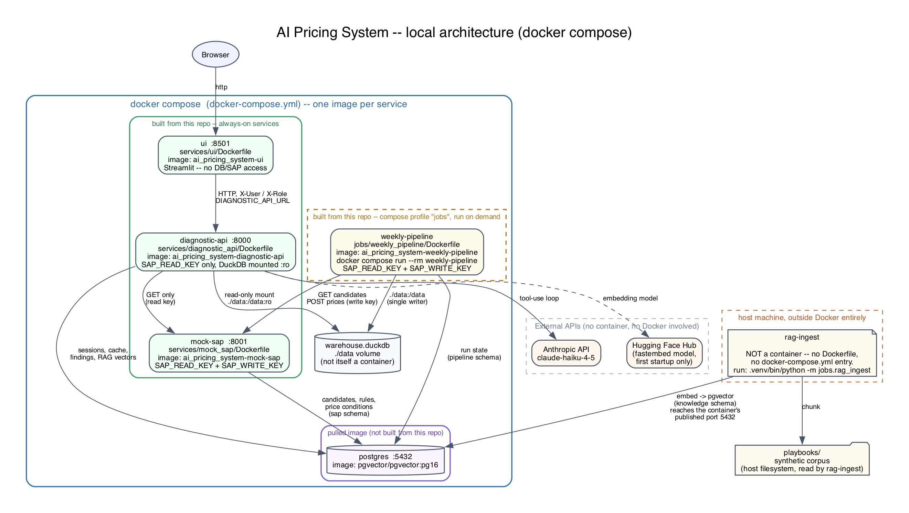

# AI Pricing System

A personal portfolio project: a local-first simulator of a retail clearance (markdown) pricing system, plus
a GenAI assistant that diagnoses why a price didn't do what it should have.

It re-creates, on **synthetic data with fictional brands**, the shape of a production pricing pipeline: a
system of record (SAP) supplies the weekly clearance list and business rules, a pricing engine computes
markdowns within those constraints, and the prices are sent back to SAP and reconciled. On top of that sits
a diagnostic assistant that answers questions like *"why didn't prices drop in VIC this week?"* by calling
deterministic tools and citing a small knowledge base of synthetic playbooks — never by guessing.

No employer code, data or internal documents are used anywhere in this repository.

## Architecture



*(source: `architecture.dot`, regenerate with `dot -Tpng -Gdpi=150 architecture.dot -o architecture.png`)*

- **The pricing side is deterministic.** A rule engine sets prices within SAP's floor, maximum markdown and
  ladder rules; an independent validation gate re-checks every rule before anything is sent, so a defect can
  never reach SAP.
- **The diagnostic side never judges a price itself.** The LLM only plans which read-only tools to call and
  explains the result; every verdict (`NOT_EFFECTIVE`, `RULE_VIOLATION`, `API_REJECTED`, ...) is computed by
  plain Python from live data. A separate knowledge base of playbooks (tag-matched, with similarity search
  as a fallback) supplies the *why* and *who owns it* — see `playbooks/README.md`.
- The diagnostic service holds a **read-only** SAP key and a **read-only** mount of the warehouse; it has no
  way to change a price, enforced by its container's environment and filesystem, not just by code.

## What's built

| Step | | |
|---|---|---|
| 1 | Synthetic data generator (DuckDB + SAP) | done |
| 2 | Pricing engine (deterministic markdown rules) | done |
| 3 | mock-sap + retrying sender, fault injection | done |
| 4 | Weekly pipeline (ingest → price → validate → send → reconcile → history) | done |
| 5 | diagnostic-api: tools, LLM loop, sessions, cache, findings | done |
| 6 | Knowledge base (RAG): playbooks, embeddings, search, retrieval eval | done |
| 7 | Streamlit chat ui | done |
| 8 | Containers for diagnostic-api and ui | done |
| 8 | IAM / deploy scripts for GCP | not started |
| 9 | Actual GCP deployment | not started |

339 automated tests, most of them requiring nothing but Python; the rest need the Postgres container. See
`docs/PROJECT_CONTEXT.md` (local, not tracked in git) for the full design write-up.

## Requirements

- **Python 3.11+** (the Anthropic SDK's 1.x line needs it). On macOS, `python3` on `PATH` is often the
  system's old bundled Python (3.9), not a modern one — check `python3 --version` first, or point the venv
  at a specific interpreter (e.g. `/opt/homebrew/bin/python3.13`, or whatever `pyenv`/`conda` gives you).
  Using the wrong one won't fail loudly; pip will just silently resolve several packages down to old
  versions still compatible with it.
- **Docker** and **Docker Compose** (for Postgres, mock-sap, and optionally diagnostic-api/ui as containers).
- An [Anthropic API key](https://console.anthropic.com) for real answers — optional; `LLM_PROVIDER=scripted`
  runs the assistant offline with no key, replaying a canned investigation.
- **`requirements.txt`** is the human-edited list of what's needed, unpinned except where a version genuinely
  matters (`duckdb`, pinned to match across the containers that share the same warehouse file). For an exact,
  reproducible set of versions, install from **`requirements-lock.txt`** instead (regenerate it with a clean
  venv built from the *correct* interpreter — see `requirements-lock.txt`'s own header for the exact command).

## Quick start

```bash
python3.13 -m venv .venv && .venv/bin/pip install -r requirements.txt   # or requirements-lock.txt to pin exact versions
cp .env.example .env    # then set ANTHROPIC_API_KEY and LLM_PROVIDER=anthropic
```

Bring up the databases first, seed the synthetic data, price and send a week, build the knowledge base,
then bring up the assistant:

```bash
docker compose up -d postgres mock-sap

.venv/bin/python -m jobs.data_gen.generate --force                    # seed DuckDB + SAP (full reset)
.venv/bin/python -m jobs.data_gen.scenarios --apply promo overlap     # plant two demo problems (optional)
.venv/bin/python -m jobs.weekly_pipeline --week 2026-W39 --run-id demo
.venv/bin/python -m jobs.rag_ingest                                   # embed the playbooks into Postgres

docker compose up -d diagnostic-api ui
```

Open **http://localhost:8501**, start a session, and ask:

> Larkspur clearance this week: many prices didn't drop in VIC, NSW is fine. Why?

## Tests

```bash
docker compose up -d postgres    # most tests need it; a few run without any database
.venv/bin/python -m pytest tests -q
```

## Repository layout

```
jobs/                weekly pipeline, synthetic data generator, RAG ingest job
services/mock_sap/    stand-in for SAP: clearance list, price submission, fault injection
services/diagnostic_api/   tools, LLM loop, sessions, tool cache, findings, RAG search
services/ui/          Streamlit chat client
shared/               config, warehouse client, Postgres schemas, embeddings
playbooks/            synthetic playbooks, incident notes, policies (the RAG corpus)
evals/                retrieval evaluation set and harness
tests/                pytest suite
```

## License

No license has been chosen yet; treat this as "all rights reserved, portfolio viewing only" until that's
decided.
